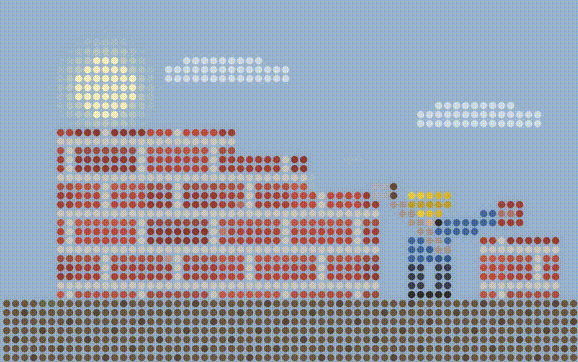

# Dot Matrix

**A skill for Claude Code, Cursor, and Codex that generates ambient dot-matrix scene videos.**

Two bundled scenes · 64×40 dot grid · seamless-loop MP4 · bloom + anti-aliasing · custom scene authoring.

<p align="center">
  
</p>

Dot Matrix renders a glowing grid of dots frame-by-frame from a Python scene module and encodes a seamless-loop MP4 with soft bloom and oversample anti-aliasing. Each scene is a small Python file that controls every pixel's color at every timestep — warm dioramas, rainy night windows, cityscapes, and anything you can write in a `scene_color(gx, gy, t, W, H)` function.

---

## Install

Install with the Skills CLI:

```bash
npx skills add Somu878/skills --skill dotmatrix -g
```

Or from a full GitHub URL:

```bash
npx skills add https://github.com/Somu878/skills --skill dotmatrix -g
```

For local testing from this repo:

```bash
npx skills add . --skill dotmatrix
```

---

## How it works

When you invoke the skill, the agent:

1. Selects a bundled scene (or helps you author a new one)
2. Invokes `render_scene.py` with the scene module and your parameters
3. Encodes a seamless-loop MP4 with bloom, oversampling, and self-check validation
4. Delivers the video to your working directory

The skill is read-only — it renders into your project directory, never into the skill directory itself.

---

## What triggers it

The skill activates when you ask for:

- A dot-matrix animation or "Claude FM" style video
- An ambient lo-fi scene (cozy study, rainy window, city lights)
- A dot-matrix background or looping wallpaper
- "Make me a Claude FM video" / "render a dot-matrix diorama"

---

## Bundled scenes

| Scene | File | Description |
|-------|------|-------------|
| Cozy Study | `assets/cozy_study.py` | Warm study with bookshelf, fireplace, lamp, reading person, plant — classic Claude FM vibe |
| Rain Window | `assets/rain_window.py` | Rainy window at night with city lights, lightning flashes, and water droplets |

When the mood is vague ("ambient dot-matrix scene"), the skill defaults to `cozy_study.py`.

---

## Authoring a custom scene

Write a Python module that exports:

```python
SCENE_W = 64
SCENE_H = 40
BG = (r, g, b)

def scene_color(gx, gy, t, W, H):
    # return (r, g, b) for dot at (gx, gy) at normalized time t ∈ [0, 1)
    ...
```

For a seamless loop, ensure `scene_color(..., t=0) == scene_color(..., t→1)`. Use `sin`/`cos` of `t * 2π * k` or phase variables wrapped with `% 1.0`.

Full contract and helpers: [`references/writing-a-scene.md`](references/writing-a-scene.md)
Copy-paste palettes: [`references/palettes.md`](references/palettes.md)

---

## CLI parameters

```
python3 scripts/render_scene.py \
  --scene <path>      # scene module path (required)
  --output <path>     # output .mp4 path (required)
  --duration 24       # loop length in seconds
  --fps 24            # frames per second
  --dot-size 14       # dot diameter in px
  --gap 4             # px gap between dots
  --scale 2           # oversample for anti-aliasing
  --bloom 0.18        # glow blend 0..1 (0 = off)
  --self-check        # verify output after writing
```

---

## Skill

The skill lives at:

```
dotmatrix/SKILL.md
```

---

## Requirements

- Python 3 + [Pillow](https://pypi.org/project/Pillow/) (`pip install pillow`)
- [ffmpeg](https://ffmpeg.org/) on PATH

---

## Demo

[Download full video (mp4)](https://github.com/Somu878/skills/raw/main/dotmatrix/demo.mp4)

---

## License

MIT
